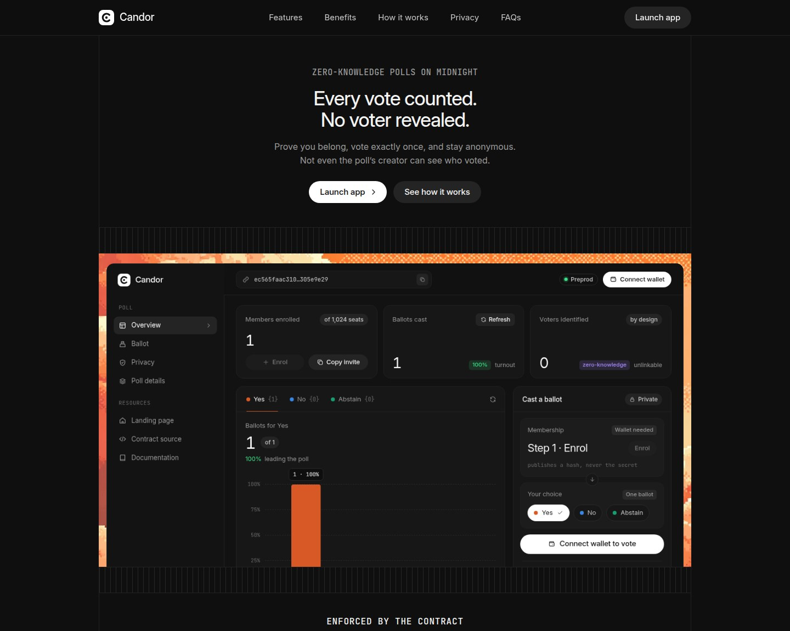
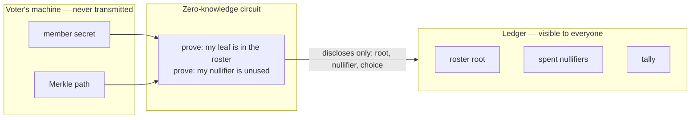
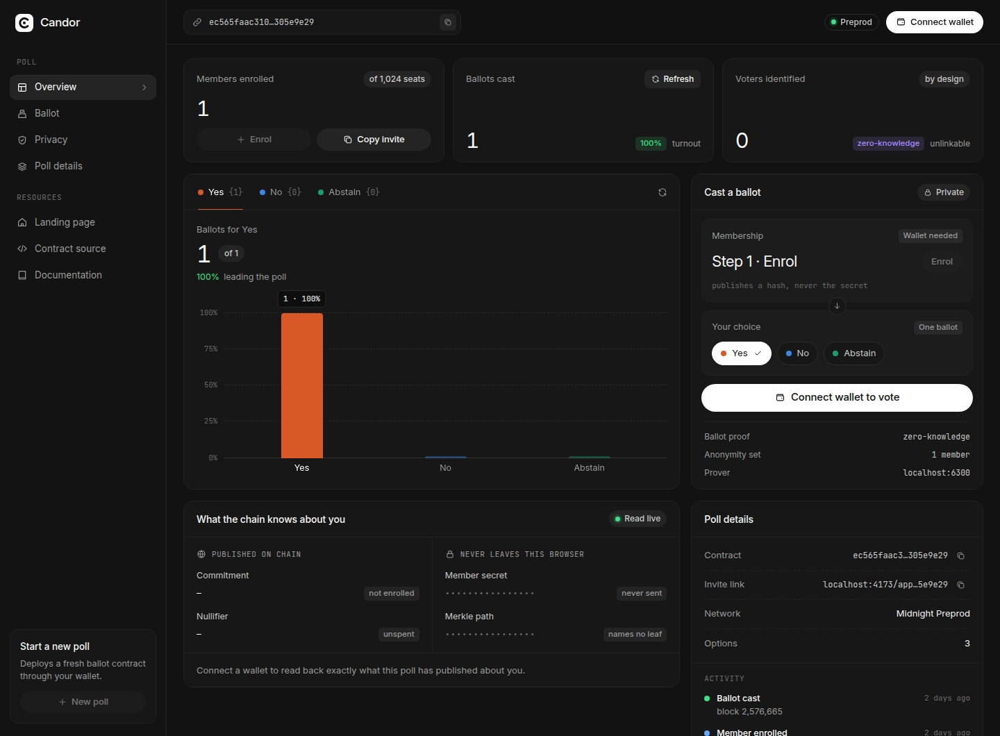
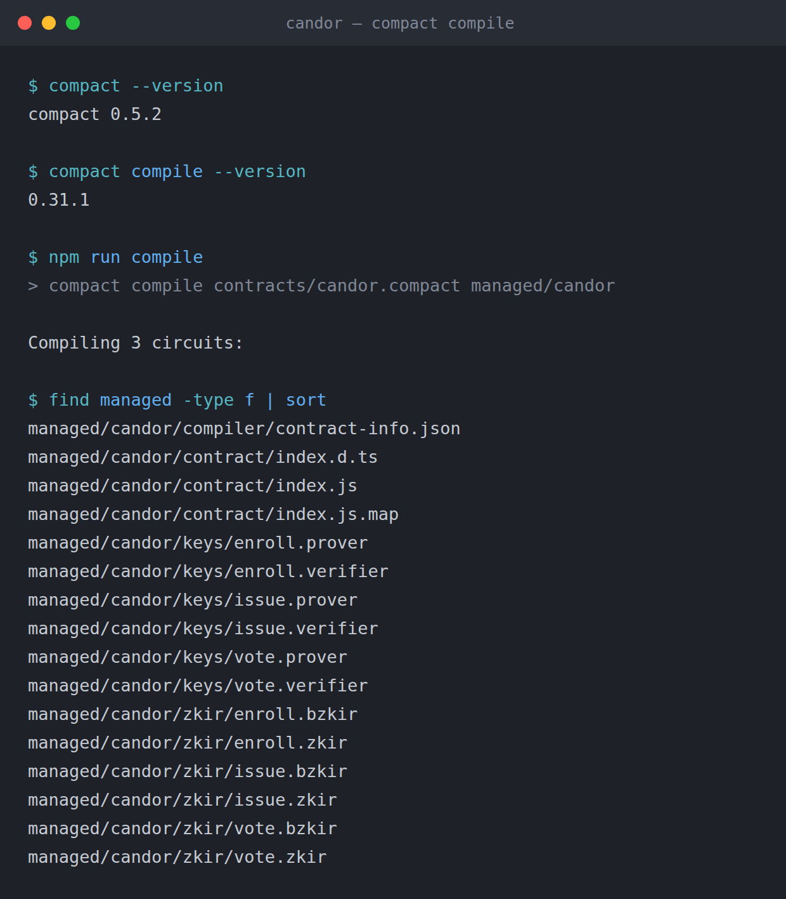
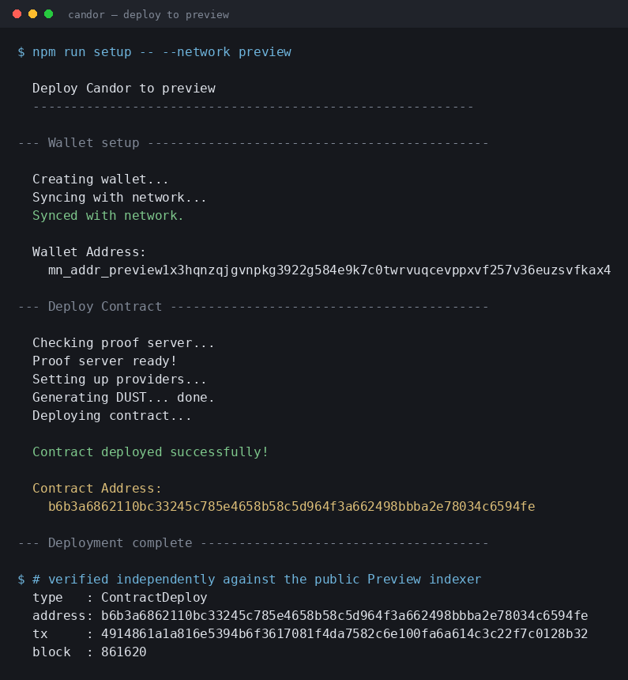

# Candor

[](https://github.com/atharvsp02/candor/actions/workflows/ci.yml)

> Anonymous polling where the anonymity is proven, not promised. One member, one ballot, enforced by a zero-knowledge proof.



## Contract Address

| Network | Address | Deployed at |
|---------|---------|-------------|
| **Preprod** | `ec565faac3103ff42017cebd3cc2510407b2068aa164ee54349ed7f0305e9e29` | block 2573777 |
| Preview | `b6b3a6862110bc33245c785e4658b58c5d964f3a662498bbba2e78034c6594fe` | block 861620 |

Don't take my word for it — ask the public indexer:

```bash
curl -s -X POST https://indexer.preprod.midnight.network/api/v4/graphql \
  -H 'Content-Type: application/json' \
  -d '{"query":"{ contractAction(address: \"ec565faac3103ff42017cebd3cc2510407b2068aa164ee54349ed7f0305e9e29\") { __typename transaction { hash block { height } } } }"}'
```

It answers `ContractDeploy`, transaction `8c3284f69a795bd58fcf404f519ccf9d26909d55f2975ee747d04d75476453ce`.

The Preprod contract was deployed from the browser through Lace — see [Deploying through the wallet](#deploying-through-the-wallet).

## The problem

Every "anonymous" survey you have ever filled in was anonymous because somebody told you it was. The vendor holds the responses. An administrator holds the dashboard. The only thing between your answer and your name is a policy document and the assumption that nobody will go looking.

Respondents understand this perfectly well, so they answer the way they are supposed to answer. The survey then measures what people are willing to say rather than what they think, and the organisation running it makes decisions on the difference.

You cannot fix that with a stronger promise. The promise is the flaw.

## What Candor does

A poll is a deployed contract. Members enrol by publishing a commitment to a secret that never leaves their machine. To vote, a member proves — in zero knowledge — two things at once:

1. their commitment is somewhere in the roster, and
2. they have not voted in this poll before.

Neither proof reveals *which* member they are. The tally moves. The link between a voter and their ballot is never written down, so there is nothing for an operator to leak, lose, subpoena, or sell.

The count is publicly auditable. The voters are not.

## How it works



**Enrolling** publishes `commitment = hash("candor:member:v1", secret)` into a Merkle tree. This is a public act — the roster is meant to be inspectable, so anyone can confirm who was entitled to vote.

**Voting** proves the secret behind *some* leaf of that tree, and spends `nullifier = hash("candor:nullifier:v1", secret)`. The nullifier is stable for a given member, so a second ballot is rejected. It shares no preimage with the commitment, so it cannot be traced back to the leaf it came from.

The anonymity set is every enrolled member.

## Privacy Model

**PUBLIC** — on the ledger, readable by anyone:

| State | Meaning |
|-------|---------|
| `roster` | Merkle tree of member commitments |
| `members` | the same commitments as a set, so nobody enrols twice |
| `spent` | nullifiers that have already been used |
| `tally` | vote count per option |
| `choices` | number of options on the ballot |
| `enrolled` / `cast` | members admitted, ballots accepted |

**PRIVATE** — witnesses, which never leave the voter's machine:

| Witness | Meaning |
|---------|---------|
| `memberSecret` | the voter's secret key |
| `memberPath` | the Merkle path that identifies the voter's leaf |

**PROVED WITHOUT REVEALING** — that the voter's commitment sits somewhere in the roster, and that this is their first ballot, without revealing which leaf is theirs.

## Privacy Claim

**Claim:** an observer with full access to the chain, the indexer, and the contract source can determine
that a ballot was cast and which option it chose, but cannot determine which enrolled member cast it.

**What is published, and why it does not identify you**

| Value | Published | Why it is safe |
|---|---|---|
| Commitment `hash("candor:member:v1", secret)` | at enrolment | It is a one-way hash, and enrolment is a separate transaction from voting |
| Nullifier `hash("candor:nullifier:v1", secret)` | at voting | Shares no preimage with the commitment; linking the two requires inverting the hash |
| Merkle root of the roster | at voting | Already public — it is the tree every member is in |
| The chosen option | at voting | The response is meant to be counted; the respondent is not |

**What is never transmitted**

The member secret and the Merkle path stay in the voter's browser. The path is the value that would
identify which leaf is theirs, which is exactly why it is a witness and not an argument.

**Where the claim would break, and how the contract prevents it**

An earlier version kept the roster in a `Set` and checked `roster.member(commitment)`. That publishes
the voter's own commitment at vote time, which links voter to ballot directly. The compiler refused to
compile it without an explicit `disclose()`, and the fix was the Merkle tree: the voter discloses the
computed root, which is already public, and proves membership without naming a leaf.

**How to verify it yourself**

Connect a wallet in the live demo. The "What the chain knows about you" panel reads your commitment and
nullifier back from the ledger and shows the size of the anonymity set they are hidden within. Every
value shown is fetched from the chain; the two redacted rows are redacted because there is nothing on
chain to fetch.

### What an observer actually sees

| Observable | Hidden |
|---|---|
| A ballot was cast | Who cast it |
| Which option it was for | Which of the enrolled members chose it |
| A 32-byte nullifier | Any link from that nullifier to a commitment |
| The full roster of commitments | Which commitment belongs to which person |

## Design notes

### Why a Merkle tree and not a set

The first version kept the roster in a `Set` and checked `roster.member(commitment)`. The compiler refused to build it without an explicit `disclose()`, and it was right to: looking a member up by their own commitment publishes that commitment, so anyone watching the transaction learns exactly who is voting. The anonymity would have been decorative.

A Merkle tree removes the need to name yourself. The voter keeps the path private and discloses only the computed root, which is already public information. The proof shows that *some* leaf hashes up to that root and says nothing about which one.

This is the one place in the contract where `disclose()` carries real weight, and it is disclosing a value that was already public. That is the distinction worth internalising: `disclose()` is not a switch that makes data public, it is a declaration that you have thought about a value crossing into a public domain and consider it safe.

### Why duplicate enrolment is blocked

A member could originally enrol the same commitment repeatedly. The nullifier still held one-member-one-ballot, so the tally stayed honest — but `enrolled` overstated the roster, which made the anonymity set look larger than it really was. Since the commitment is already public the moment it enters the tree, keeping a parallel `Set` to reject duplicates costs nothing in privacy and keeps the published numbers truthful.

### Deploying through the wallet

The Preprod contract was not deployed from a script. It was deployed from the browser, through Lace.

A Node deploy needs its own wallet, and a fresh wallet has to scan the chain before it can spend
anything. On Preprod that is roughly 2.5M blocks, and two attempts here ran 30 and 54 minutes before
failing. Lace already tracks the chain, so `deployContract` runs against the browser providers and the
problem disappears.

It also turned out to be the better product. A poll is one contract, so creating a poll *is* deploying
one — that is a thing a user should be able to do, not an operator-only script. The address lands in
`?poll=`, which makes the poll a link you can send to someone.

Two preconditions are easy to miss, and both fail silently:

- **NIGHT must be designated before it generates DUST.** Holding it is not enough. Undesignated NIGHT
  shows a DUST tank of `0/0` with a fill time of `none`, and every signature attempt does nothing at
  all rather than reporting why.
- **The prover the wallet reports has to be reachable from the browser.** Lace's own banner says a local
  proof server is mandatory, but its settings also offer a hosted prover that works. The app lets
  `VITE_PROOF_SERVER_URI` override whatever the wallet reports.

### One poll per deployment

Each poll is its own contract, so nullifiers never need a round counter and there is no administrator who can reopen or rewrite a closed poll. Deploying is cheap; shared mutable state is not.

## The contract

```compact
export circuit vote(choice: Uint<8>): [] {
  const pick = disclose(choice);
  assert(pick < choices, "choice is not on the ballot");

  const sk = memberSecret();
  const path = memberPath();
  assert(path.leaf == commitment(sk), "path does not belong to this secret");
  assert(
    roster.checkRoot(disclose(merkleTreePathRoot<10, Bytes<32>>(path))),
    "not enrolled in this poll"
  );

  const tag = disclose(nullifier(sk));
  assert(!spent.member(tag), "this member has already voted");
  spent.insert(tag);

  tally.lookup(pick).increment(1);
  cast.increment(1);
}
```

Full source: [`contracts/candor.compact`](contracts/candor.compact).

## Tech Stack

Midnight · Compact `0.31.1` · Midnight.js `4.1.x` · DApp Connector API v4 · React 19 · Vite 7 · TypeScript · Node.js 22 · Vitest · Docker

## Prerequisites

- **Node.js 22+**
- **A Midnight wallet** — [1AM](https://chromewebstore.google.com/detail/1am/bphnkdkcnfhompoegfpgnkidcjfbojjp) or [Lace](https://chromewebstore.google.com/detail/lace/gafhhkghbfjjkeiendhlofajokpaflmk), set to Preprod and funded from the [faucet](https://faucet.preprod.midnight.network)
- **Docker** — runs the proof server and the bundled local devnet
- **The Compact toolchain:**
  ```bash
  curl --proto '=https' --tlsv1.2 -LsSf \
    https://github.com/midnightntwrk/compact/releases/latest/download/compact-installer.sh | sh
  compact update 0.31.1
  ```

  Pin `0.31.1` explicitly. The installer defaults to the newest compiler, which is
  ahead of what the surrounding tooling expects.

## Setup

```bash
git clone https://github.com/atharvsp02/candor.git
cd candor
npm install
npm run compile
```

`npm run compile` writes the circuits and the proving/verifying keys into `managed/candor/`.

## Run Tests

```bash
npm test
```

Ten tests in three groups:

- **circuit logic** — a poll needs at least two options, enrolling stores the commitment it returns, a member is admitted only once, a ballot off the end of the list is refused
- **state transitions** — the tally moves only for the option chosen, one nullifier is spent per ballot, an unenrolled secret is turned away
- **privacy** — no member secret reaches the ledger, the published nullifier is not the published commitment, and no commitment appears alongside the ballots

The privacy group is the point. It asserts the properties this product actually claims, so a change that quietly breaks anonymity fails the suite rather than shipping.

## Run the web app

```bash
cp .env.example .env
npm run dev
```

Open `http://localhost:5173` for the landing page, or go straight to `http://localhost:5173/app`,
connect a wallet, then enrol and vote. `npm run dev` copies the proving
keys into `public/`, because the browser fetches them from the app's own origin before it proves.

| Variable | Purpose |
|---|---|
| `VITE_NETWORK_ID` | `preprod` |
| `VITE_CONTRACT_ADDRESS` | the poll to open when the URL has no `?poll=` |
| `VITE_INDEXER_URI` / `VITE_INDEXER_WS_URI` | the public indexer the tally is read from |
| `VITE_PROOF_SERVER_URI` | optional — overrides the prover the wallet reports |

A poll is a contract, so its address is the share link: `/app?poll=<address>` opens that poll directly
(older `/?poll=<address>` links are redirected there).

The landing page is not a mock-up. It reads `VITE_CONTRACT_ADDRESS` from the indexer — the tally, the
roster and the last transactions on the contract are the live ones, and the preview above the fold is
the dashboard component itself.
With no poll configured, the page offers to deploy a new one through the connected wallet.

### Wallets

Any wallet that implements DApp Connector API v4 works; the app picks up whichever one has injected
itself at `window.midnight`. Both have been used against the Preprod contract: **Lace** deployed it,
and **1AM** enrolled, voted, and had a second ballot rejected by the nullifier check.

With Lace, NIGHT has to be designated before it generates the DUST that pays for transactions, and
the extension needs to be reopened after its Midnight settings change.

Proving happens in the browser against the prover URI the wallet reports. If that prover is
unreachable, set `VITE_PROOF_SERVER_URI` — for example to a local
`docker run -p 6300:6300 midnightntwrk/proof-server:8.1.0 midnight-proof-server`.

## Run the CLI

Against the bundled local devnet — no faucet, no wallet extension, no waiting:

```bash
npm run setup
npm run cli
```

The CLI is scriptable, which is what the demo uses:

```bash
npm run cli -- enrol
npm run cli -- vote 0
npm run cli -- tally
npm run cli -- demo      # enrol, vote, then read the tally
```

Against a public testnet:

```bash
npm run address -- --network preview   # prints the address to fund
npm run setup   -- --network preview
npm run cli     -- tally
```

`npm run address` derives the funding address locally, so you can fill the wallet from
the [faucet](https://midnight-tmnight-preview.nethermind.dev/) while the first sync is
still running. A fresh wallet scans the chain from the start and that takes a while —
Preprod's chain is roughly three times longer than Preview's, so budget accordingly.

Set `CANDOR_OPTIONS` to change the number of options on the ballot (default 3).

## Project Layout

```
contracts/candor.compact          the contract
managed/candor/                   compiled circuits, proving and verifying keys
tests/candor.test.ts              the test suite

src/hooks/useMidnight.ts          wallet, providers, proving and ledger reads
src/main.tsx                      routes / to the landing page and /app to the poll
src/site/                         landing page sections, with a live-rendered preview of the app
src/app/AppPage.tsx               binds the wallet hook to the dashboard and logs session activity
src/app/Dashboard.tsx             the poll dashboard, shared by /app and the landing preview
src/app/BallotPanel.tsx           connect, enrol and vote
src/app/TallyCard.tsx             live tally chart, or deploying a new poll when none is open
src/app/PrivacyCard.tsx           what the chain holds about you, read back from it
src/styles/                       design tokens, landing and dashboard styles
src/assets/art/                   cloud artwork in five palettes
src/view.ts                       ledger values converted for rendering
src/browser-private-state.ts      private state for the browser; the secret stays in localStorage

src/witnesses.ts                  witness implementations for the CLI
src/deploy.ts                     deploy to local devnet, preview, or preprod
src/cli.ts                        enrol, vote, read the tally from a terminal
src/address.ts                    derive the funding address without syncing

.github/workflows/ci.yml          compile, typecheck, test and build on every push
vercel.json                       static hosting for the web app
```

## Initial Idea

Candor is a primitive with a product attached. The primitive is anonymous, sybil-resistant polling: prove you belong to a group, vote once, reveal nothing else. The product is honest internal feedback for organisations that currently cannot buy it at any price.

Employee pulse surveys, DAO signalling votes, course evaluations, post-incident retrospectives, board confidence checks — all of them are places where the answer people give and the answer people hold are different, and they are different for one structural reason: the respondent correctly assumes the channel is not really anonymous. Every incumbent tool in this space asks you to trust an operator who is technically capable of deanonymising you, and who is often employed by the person asking the question.

Midnight is the only place this is fixable at the infrastructure layer instead of the policy layer. The roster proves the respondent was entitled to answer. The nullifier proves they answered once. The proof reveals neither. There is no privileged view, because there is no stored link to be privileged about — not for the operator, not for me, not for anyone who later buys the company or serves it a warrant.

The next step is to make the cryptography disappear. Creating a poll and sharing a link should take under a minute, and a respondent should never learn the words "Merkle" or "nullifier" — they should simply believe the anonymity, because for the first time it is worth believing.

## Screenshots

**The poll dashboard — live tally read from Preprod**



**Compile — circuits and keys generated**



**Deploy — contract live on Preview with an address**


