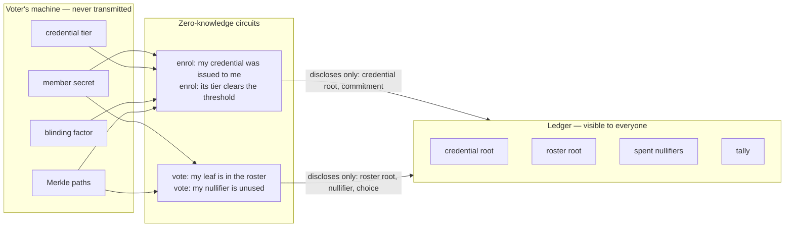
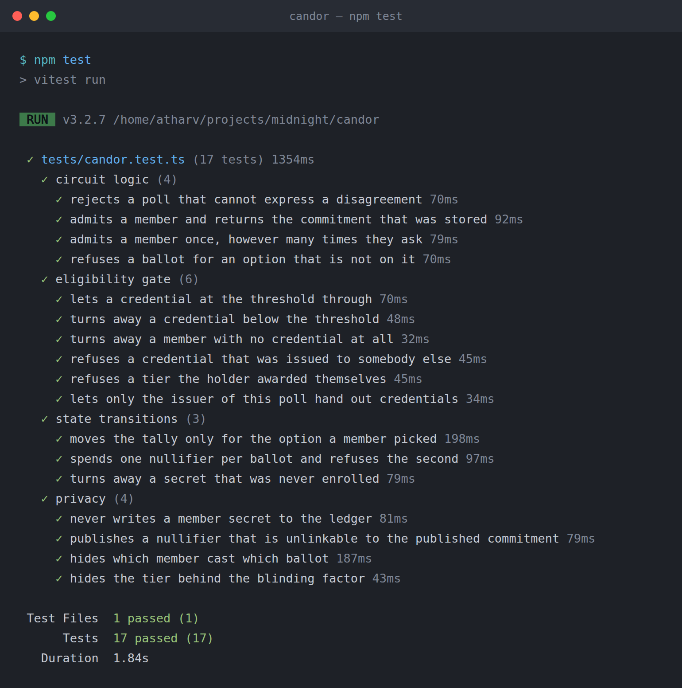

# Candor

[](https://github.com/atharvsp02/candor/actions/workflows/ci.yml)

> Anonymous polling where the anonymity is proven, not promised. One member, one ballot, enforced by a zero-knowledge proof.

**Live demo:** [candor-self.vercel.app](https://candor-self.vercel.app) — the landing page explains it, and
[`/app`](https://candor-self.vercel.app/app) opens the poll running on Midnight Preprod.

**Product proposal:** [Private Voting — anonymous ballots with publicly verifiable tallies](PROPOSAL.md)

**Demo video:** [wallet connect, enrolment and a ballot on Preprod](https://drive.google.com/file/d/1nB7RrsJC5um1R07RGWUv-DnH1BbdcbnE/view?usp=sharing)
(1:52) — connecting 1AM, enrolling a member, casting a ballot, and reading the commitment and spent
nullifier back off the chain.


## Contract Address

| Network | Address | Deployed at | Notes |
|---------|---------|-------------|-------|
| **Preprod** | `815ed0190cbdb7889c490cff10a3f5451ac096d3b702c08ae1a71200db2c5f31` | block 2684775 | current — gated by an issued credential |
| Preprod | `ec565faac3103ff42017cebd3cc2510407b2068aa164ee54349ed7f0305e9e29` | block 2573777 | earlier build, open enrolment |
| Preview | `b6b3a6862110bc33245c785e4658b58c5d964f3a662498bbba2e78034c6594fe` | block 861620 | first deployment |

Don't take my word for it — ask the public indexer:

```bash
curl -s -X POST https://indexer.preprod.midnight.network/api/v4/graphql \
  -H 'Content-Type: application/json' \
  -d '{"query":"{ contractAction(address: \"815ed0190cbdb7889c490cff10a3f5451ac096d3b702c08ae1a71200db2c5f31\") { __typename transaction { hash block { height } } } }"}'
```

It answers `ContractDeploy`. Both Preprod polls were deployed from the browser through a wallet — see
[Deploying through the wallet](#deploying-through-the-wallet).

## The problem

Every "anonymous" survey you have ever filled in was anonymous because somebody told you it was. The vendor holds the responses. An administrator holds the dashboard. The only thing between your answer and your name is a policy document and the assumption that nobody will go looking.

Respondents understand this perfectly well, so they answer the way they are supposed to answer. The survey then measures what people are willing to say rather than what they think, and the organisation running it makes decisions on the difference.

You cannot fix that with a stronger promise. The promise is the flaw.

## What Candor does

A poll is a deployed contract with an organiser who decides who is entitled to answer.

The organiser issues each eligible person a **credential** carrying a tier — a grade, a seniority band, a
stake threshold, whatever the poll is gating on. Only a hash of that credential reaches the chain.

To enrol, a member proves in zero knowledge that a credential was issued *to them* and that its tier
clears the poll's threshold, without revealing the tier or which credential it is. Enrolment publishes a
commitment to a secret that never leaves their machine.

To vote, a member proves two more things at once:

1. their commitment is somewhere in the roster, and
2. they have not voted in this poll before.

None of these proofs reveal *which* member they are. The tally moves. The link between a voter and their
ballot is never written down, so there is nothing for an operator to leak, lose, subpoena, or sell.

The count is publicly auditable. The eligibility is enforced. The voters are not identified.

## How it works



**Issuing** writes `leaf = hash("candor:credential:v1", holder, tier, blind)` into a credential tree. The
circuit checks that the caller holds the issuer key this poll was created with, so nobody can mint their
own eligibility. The tier is inside the hash, and the blinding factor is what stops anyone trying all
eight tiers until the hash matches.

**Enrolling** proves that leaf is in the credential tree, that its `holder` is the caller's own
commitment, and that `tier >= minTier` — then publishes `commitment = hash("candor:member:v1", secret)`
into the roster. The roster is meant to be inspectable, so anyone can confirm who was entitled to vote;
the credential behind each entry is not.

**Voting** proves the secret behind *some* leaf of the roster, and spends `nullifier = hash("candor:nullifier:v1", secret)`. The nullifier is stable for a given member, so a second ballot is rejected. It shares no preimage with the commitment, so it cannot be traced back to the leaf it came from.

The anonymity set is every enrolled member.

## Privacy Model

A poll discloses exactly three things and hides everything else.

**PUBLIC** — on the ledger, readable by anyone:

| State | Meaning |
|-------|---------|
| `credentials` | Merkle tree of issued credential hashes |
| `issuer` | hash of the issuer key, fixed when the poll is created |
| `minTier` | the tier a credential must reach to enrol |
| `issued` | how many credentials have been handed out |
| `roster` | Merkle tree of member commitments |
| `members` | the same commitments as a set, so nobody enrols twice |
| `spent` | nullifiers that have already been used |
| `tally` | vote count per option |
| `choices` | number of options on the ballot |
| `enrolled` / `cast` | members admitted, ballots accepted |

**PRIVATE** — witnesses, which never leave the holder's machine:

| Witness | Meaning |
|---------|---------|
| `memberSecret` | the voter's secret key |
| `memberTier` | the tier the issuer granted them |
| `credentialBlind` | the blinding factor that hides the tier inside the published hash |
| `credentialPath` | the Merkle path to their credential |
| `memberPath` | the Merkle path that identifies the voter's roster leaf |
| `issuerSecret` | the issuer's key, held by whoever runs the poll |

**PROVED WITHOUT REVEALING**

At enrolment: that a credential for this member sits in the credential tree, that it binds to their own
secret, and that its tier meets `minTier` — without revealing the tier, the blinding factor, or which
credential it is.

At voting: that the member's commitment sits somewhere in the roster and has not voted before — without
revealing which leaf is theirs.

### What an observer can and cannot learn

| An observer sees | An observer cannot tell |
|---|---|
| A credential was issued (a 32-byte hash) | Who it was issued to, or what tier it grants |
| Someone eligible enrolled | Which credential they used, or how far above the threshold they were |
| A ballot was cast, and for which option | Which of the enrolled members cast it |
| The number issued, enrolled and cast | Any link between a credential, a commitment and a nullifier |

The blinding factor is what makes the tier private. Tiers are small numbers, so a hash of
`(holder, tier)` alone could be brute-forced by trying every tier; `(holder, tier, blind)` cannot.

## Privacy Claim

**Claim:** an observer with full access to the chain, the indexer, and the contract source can determine
that a ballot was cast and which option it chose, but cannot determine which enrolled member cast it, and
cannot determine what tier of credential anyone was issued.

**What is published, and why it does not identify you**

| Value | Published | Why it is safe |
|---|---|---|
| Credential `hash("candor:credential:v1", holder, tier, blind)` | at issue | The tier is inside a hash with 32 bytes of blinding, so the domain is not small enough to search |
| Commitment `hash("candor:member:v1", secret)` | at enrolment | It is a one-way hash, and enrolment is a separate transaction from voting |
| Merkle root of the credential tree | at enrolment | Already public — it is the tree every credential is in |
| Nullifier `hash("candor:nullifier:v1", secret)` | at voting | Shares no preimage with the commitment; linking the two requires inverting the hash |
| Merkle root of the roster | at voting | Already public — it is the tree every member is in |
| The chosen option | at voting | The response is meant to be counted; the respondent is not |

**What is never transmitted**

The member secret, the credential tier, the blinding factor and both Merkle paths stay in the voter's
browser. A path is the value that would identify which leaf is theirs, which is exactly why it is a
witness and not an argument. The issuer's key never leaves the organiser's browser either — the poll
stores only its hash.

**Where the claim would break, and how the contract prevents it**

An earlier version kept the roster in a `Set` and checked `roster.member(commitment)`. That publishes
the voter's own commitment at vote time, which links voter to ballot directly. The compiler refused to
compile it without an explicit `disclose()`, and the fix was the Merkle tree: the voter discloses the
computed root, which is already public, and proves membership without naming a leaf.

**How to verify it yourself**

Connect a wallet in the live demo. The "What the chain knows about you" panel reads your commitment and
nullifier back from the ledger and shows the size of the anonymity set they are hidden within. Every
value shown is fetched from the chain; the two redacted rows are redacted because there is nothing on
chain to fetch.

## Design notes

### Why a Merkle tree and not a set

The first version kept the roster in a `Set` and checked `roster.member(commitment)`. The compiler refused to build it without an explicit `disclose()`, and it was right to: looking a member up by their own commitment publishes that commitment, so anyone watching the transaction learns exactly who is voting. The anonymity would have been decorative.

A Merkle tree removes the need to name yourself. The voter keeps the path private and discloses only the computed root, which is already public information. The proof shows that *some* leaf hashes up to that root and says nothing about which one.

This is the one place in the contract where `disclose()` carries real weight, and it is disclosing a value that was already public. That is the distinction worth internalising: `disclose()` is not a switch that makes data public, it is a declaration that you have thought about a value crossing into a public domain and consider it safe.

### Why duplicate enrolment is blocked

A member could originally enrol the same commitment repeatedly. The nullifier still held one-member-one-ballot, so the tally stayed honest — but `enrolled` overstated the roster, which made the anonymity set look larger than it really was. Since the commitment is already public the moment it enters the tree, keeping a parallel `Set` to reject duplicates costs nothing in privacy and keeps the published numbers truthful.

### Deploying through the wallet

The Preprod contract was not deployed from a script. It was deployed from the browser, through Lace.

A Node deploy needs its own wallet, and a fresh wallet has to scan the chain before it can spend
anything. On Preprod that is roughly 2.5M blocks, and two attempts here ran 30 and 54 minutes before
failing. Lace already tracks the chain, so `deployContract` runs against the browser providers and the
problem disappears.

It also turned out to be the better product. A poll is one contract, so creating a poll *is* deploying
one — that is a thing a user should be able to do, not an operator-only script. The address lands in
`?poll=`, which makes the poll a link you can send to someone.

Two preconditions are easy to miss, and both fail silently:

- **NIGHT must be designated before it generates DUST.** Holding it is not enough. Undesignated NIGHT
  shows a DUST tank of `0/0` with a fill time of `none`, and every signature attempt does nothing at
  all rather than reporting why.
- **The prover the wallet reports has to be reachable from the browser.** Lace's own banner says a local
  proof server is mandatory, but its settings also offer a hosted prover that works. The app lets
  `VITE_PROOF_SERVER_URI` override whatever the wallet reports.

### Why the proving keys live at a hashed path

The proving and verifying keys are served from the app's own origin, because the browser fetches them
before it can prove. They are large — five megabytes for `enroll` — so the first version of `vercel.json`
cached them with `max-age=31536000, immutable`.

That was wrong, and it broke the live site the first time the circuits changed. Vite content-hashes its
own bundles, so `assets/index-<hash>.js` is safe to freeze forever. `keys/enroll.verifier` was not
hashed: the bytes behind that URL changed when the eligibility gate was added, but the URL did not, and
`immutable` means the browser never asks again. Returning visitors handed Level 2 verifier keys to a
Level 3 contract and got a `mismatched verifier keys` error that reads like a contract bug.

The symptom named `enroll` and `vote` but not `issue`, which is the whole story in one line: `issue` was
a new file, so nothing had it cached. Local development never saw it either, because the Vite dev server
does not send those headers.

Relaxing the header would have fixed future deploys and done nothing for browsers already holding an
immutable entry — they will not revalidate for a year, and no header can reach them. Only a different
URL can. So `npm run ui:assets` now hashes the compiled artifacts and copies them to
`public/zk/<hash>/`, and the app points `FetchZkConfigProvider` at that path. The hash is derived from
the key and zkIR bytes, so changing a circuit changes the URL, and the old entry is simply never
requested again.

That path can go back to `immutable`, correctly this time. The rule it violated: freeze a URL forever
only when its name is derived from its contents.

### Why the issuer is a key, not an address

The obvious way to gate `issue` is to check the caller's wallet address. That publishes who the
organiser is, ties the poll to one device, and makes a lost wallet a lost poll. Instead the contract
stores `hash("candor:issuer:v1", secret)` and `issue` proves knowledge of the preimage. The chain learns
that somebody authorised to issue did so, and nothing else — which is the same shape as the rest of the
contract, so the gate does not become the one place identity leaks.

### One poll per deployment

Each poll is its own contract, so nullifiers never need a round counter and there is no administrator who can reopen or rewrite a closed poll. Deploying is cheap; shared mutable state is not.

## The contract

```compact
export circuit enroll(): Bytes<32> {
  const sk = memberSecret();
  const tier = memberTier();
  const blind = credentialBlind();
  const path = credentialPath();
  const holder = commitment(sk);

  assert(tier >= minTier, "this credential is below the poll's threshold");
  assert(path.leaf == credentialLeaf(holder, tier, blind),
         "credential does not belong to this member");
  assert(
    credentials.checkRoot(disclose(merkleTreePathRoot<10, Bytes<32>>(path))),
    "no credential was issued for this member"
  );

  const leaf = disclose(holder);
  assert(!members.member(leaf), "this member is already enrolled");
  assert(!roster.isFull(), "roster is full");
  roster.insert(leaf);
  members.insert(leaf);
  enrolled.increment(1);
  return leaf;
}

export circuit vote(choice: Uint<8>): [] {
  const pick = disclose(choice);
  assert(pick < choices, "choice is not on the ballot");

  const sk = memberSecret();
  const path = memberPath();
  assert(path.leaf == commitment(sk), "path does not belong to this secret");
  assert(
    roster.checkRoot(disclose(merkleTreePathRoot<10, Bytes<32>>(path))),
    "not enrolled in this poll"
  );

  const tag = disclose(nullifier(sk));
  assert(!spent.member(tag), "this member has already voted");
  spent.insert(tag);

  tally.lookup(pick).increment(1);
  cast.increment(1);
}
```

Full source: [`contracts/candor.compact`](contracts/candor.compact).

## Tech Stack

Midnight · Compact `0.31.1` · Midnight.js `4.1.x` · DApp Connector API v4 · React 19 · Vite 7 · TypeScript · Node.js 22 · Vitest · Docker

## Prerequisites

- **Node.js 22+**
- **A Midnight wallet** — [1AM](https://chromewebstore.google.com/detail/1am/bphnkdkcnfhompoegfpgnkidcjfbojjp) or [Lace](https://chromewebstore.google.com/detail/lace/gafhhkghbfjjkeiendhlofajokpaflmk), set to Preprod and funded from the [faucet](https://faucet.preprod.midnight.network)
- **Docker** — runs the proof server and the bundled local devnet
- **The Compact toolchain:**
  ```bash
  curl --proto '=https' --tlsv1.2 -LsSf \
    https://github.com/midnightntwrk/compact/releases/latest/download/compact-installer.sh | sh
  compact update 0.31.1
  ```

  Pin `0.31.1` explicitly. The installer defaults to the newest compiler, which is
  ahead of what the surrounding tooling expects.

## Setup

```bash
git clone https://github.com/atharvsp02/candor.git
cd candor
npm install
npm run compile
```

`npm run compile` writes the circuits and the proving/verifying keys into `managed/candor/`.

## Run Tests

```bash
npm test
```

Seventeen tests in four groups:

- **circuit logic** — a poll needs at least two options, enrolling stores the commitment it returns, a member is admitted only once, a ballot off the end of the list is refused
- **eligibility gate** — a credential at the threshold gets in; one below it, one issued to somebody else, a tier the holder awarded themselves, and a member with no credential at all are all turned away; only the issuer this poll was created with can hand out credentials
- **state transitions** — the tally moves only for the option chosen, one nullifier is spent per ballot, an unenrolled secret is turned away
- **privacy** — no member secret reaches the ledger, the published nullifier is not the published commitment, no commitment appears alongside the ballots, and the tier cannot be recovered from the published credential hash

The privacy group is the point. It asserts the properties this product actually claims, so a change that quietly breaks anonymity fails the suite rather than shipping. The tier test is the sharpest of them: it brute-forces every tier a credential could carry and checks that none of them reproduces the hash on chain, which is exactly the attack the blinding factor exists to stop.

A second suite talks to a real network:

```bash
npm run test:e2e
```

It reconnects to the deployed contract through the indexer, reads the ledger back, and exits non-zero if
the poll is not where it should be.

## Run the web app

```bash
cp .env.example .env
npm run dev
```

Open `http://localhost:5173` for the landing page, or go straight to `http://localhost:5173/app`,
connect a wallet, then enrol and vote. `npm run dev` copies the proving
keys into `public/`, because the browser fetches them from the app's own origin before it proves.

| Variable | Purpose |
|---|---|
| `VITE_NETWORK_ID` | `preprod` |
| `VITE_CONTRACT_ADDRESS` | the poll to open when the URL has no `?poll=` |
| `VITE_INDEXER_URI` / `VITE_INDEXER_WS_URI` | the public indexer the tally is read from |
| `VITE_PROOF_SERVER_URI` | optional — overrides the prover the wallet reports |

A poll is a contract, so its address is the share link: `/app?poll=<address>` opens that poll directly
(older `/?poll=<address>` links are redirected there).

The landing page is not a mock-up. It reads `VITE_CONTRACT_ADDRESS` from the indexer — the tally, the
roster and the last transactions on the contract are the live ones, and the preview above the fold is
the dashboard component itself.
With no poll configured, the page offers to deploy a new one through the connected wallet.

### Wallets

Any wallet that implements DApp Connector API v4 works; the app picks up whichever one has injected
itself at `window.midnight`. Both have been used against the Preprod contract: **Lace** deployed it,
and **1AM** enrolled, voted, and had a second ballot rejected by the nullifier check.

With Lace, NIGHT has to be designated before it generates the DUST that pays for transactions, and
the extension needs to be reopened after its Midnight settings change.

Proving happens in the browser against the prover URI the wallet reports. If that prover is
unreachable, set `VITE_PROOF_SERVER_URI` — for example to a local
`docker run -p 6300:6300 midnightntwrk/proof-server:8.1.0 midnight-proof-server`.

## Run the CLI

Against the bundled local devnet — no faucet, no wallet extension, no waiting:

```bash
npm run setup
npm run cli
```

The CLI is scriptable, which is what the demo uses:

```bash
npm run cli -- issue     # the poll's issuer hands this machine a credential
npm run cli -- enrol
npm run cli -- vote 0
npm run cli -- tally
npm run cli -- demo      # issue, enrol, vote, then read the tally
```

`issue` only works where the issuer key is on file — the deploy script writes it next to the address, so
a poll you deployed yourself can credential itself. Against somebody else's poll the command refuses,
which is the point of the gate.

Against a public testnet:

```bash
npm run address -- --network preview   # prints the address to fund
npm run setup   -- --network preview
npm run cli     -- tally
```

`npm run address` derives the funding address locally, so you can fill the wallet from
the [faucet](https://midnight-tmnight-preview.nethermind.dev/) while the first sync is
still running. A fresh wallet scans the chain from the start and that takes a while —
Preprod's chain is roughly three times longer than Preview's, so budget accordingly.

| Variable | Purpose | Default |
|---|---|---|
| `CANDOR_OPTIONS` | options on the ballot, at deploy time | `3` |
| `CANDOR_MIN_TIER` | the tier a credential must reach to enrol, at deploy time | `1` |
| `CANDOR_TIER` | the tier `issue` hands out | `1` |

## Project Layout

```
contracts/candor.compact          the contract
managed/candor/                   compiled circuits, proving and verifying keys
tests/candor.test.ts              the test suite

src/hooks/useMidnight.ts          wallet, providers, proving and ledger reads
src/main.tsx                      routes / to the landing page and /app to the poll
src/site/                         landing page sections, with a live-rendered preview of the app
src/live/                         reads the poll off the indexer without loading the proving stack
src/app/AppPage.tsx               binds the wallet hook to the dashboard and logs session activity
src/app/Dashboard.tsx             the poll dashboard, shared by /app and the landing preview
src/app/BallotPanel.tsx           credential, enrolment and ballot, in that order
src/app/TallyCard.tsx             live tally chart, or deploying a new poll when none is open
src/app/PrivacyCard.tsx           what the chain holds about you, read back from it
src/styles/                       design tokens, landing and dashboard styles
src/assets/art/                   cloud artwork in five palettes
src/view.ts                       ledger values converted for rendering
src/browser-private-state.ts      secret, credential and issuer key, kept in localStorage

src/witnesses.ts                  witness implementations, shared by the tests and the CLI
src/deploy.ts                     deploy to local devnet, preview, or preprod
src/cli.ts                        issue, enrol, vote, read the tally from a terminal
src/address.ts                    derive the funding address without syncing

scripts/ui-assets.mjs             copies the keys and zkIRs to a content-hashed public path
scripts/e2e-check.ts              reconnects to the deployed poll and reads its ledger back
.github/workflows/ci.yml          compile, typecheck, test and build on every push
vercel.json                       static hosting for the web app
```

## Initial Idea

The full write-up is in [PROPOSAL.md](PROPOSAL.md) — the problem, who it is for, why Midnight is the only
place it is buildable honestly, and what the remaining levels deliver. The short version:

Candor is a primitive with a product attached. The primitive is anonymous, sybil-resistant polling: prove you belong to a group, vote once, reveal nothing else. The product is honest internal feedback for organisations that currently cannot buy it at any price.

Employee pulse surveys, DAO signalling votes, course evaluations, post-incident retrospectives, board confidence checks — all of them are places where the answer people give and the answer people hold are different, and they are different for one structural reason: the respondent correctly assumes the channel is not really anonymous. Every incumbent tool in this space asks you to trust an operator who is technically capable of deanonymising you, and who is often employed by the person asking the question.

Midnight is the only place this is fixable at the infrastructure layer instead of the policy layer. The roster proves the respondent was entitled to answer. The nullifier proves they answered once. The proof reveals neither. There is no privileged view, because there is no stored link to be privileged about — not for the operator, not for me, not for anyone who later buys the company or serves it a warrant.

The next step is to make the cryptography disappear. Creating a poll and sharing a link should take under a minute, and a respondent should never learn the words "Merkle" or "nullifier" — they should simply believe the anonymity, because for the first time it is worth believing.

## Screenshots

**The poll dashboard — live tally read from Preprod**


**Tests — the eligibility gate and the privacy properties, asserted**



**Compile — three circuits, with proving and verifying keys for each**


**Deploy — contract live on Preview with an address**


